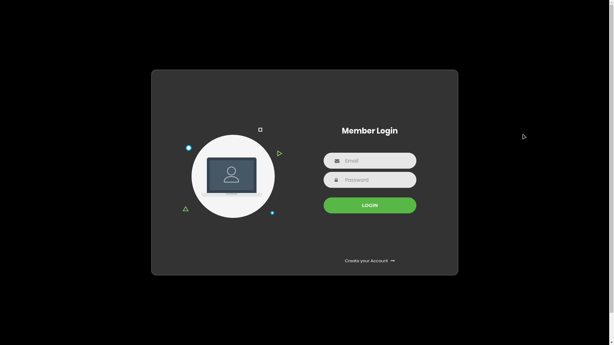
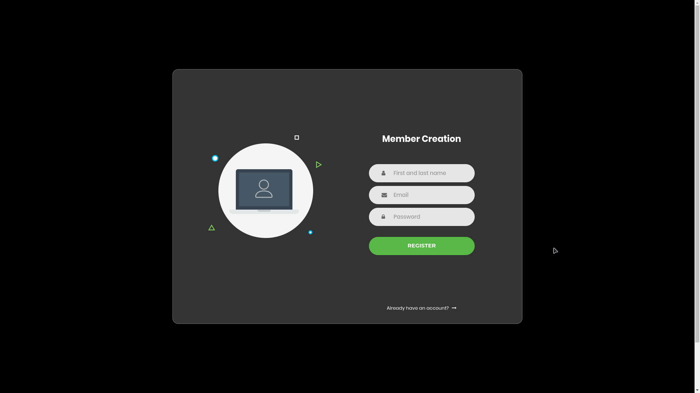
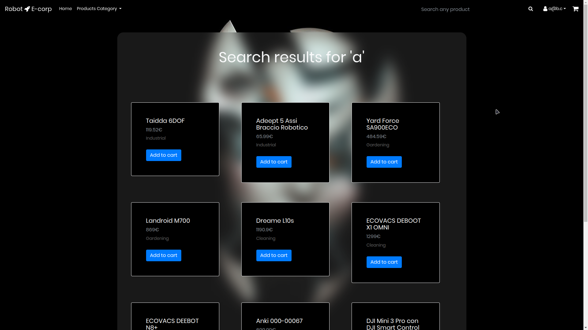
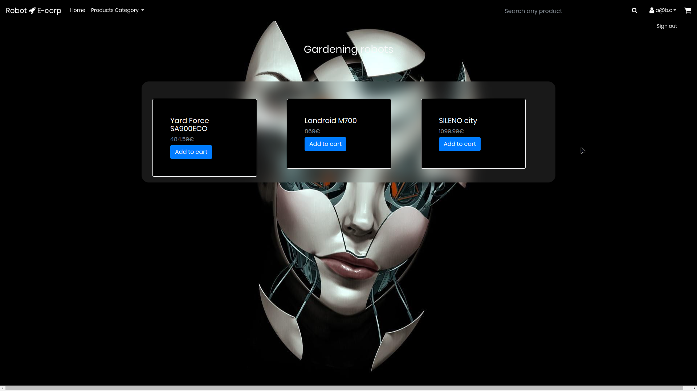

# Descrizione
Il nostro è un sito web di vendita di robot, con utenti (e quindi login), ricerca dei prodotti e pagine per ogni categoria.  
### Funzionalità non ancora abilitate (popup con "Funzione WIP")
* Carrello
### Funzionalità non ancora implementate:
* Divisione tra utenti b2b e b2c, con tutte le modifiche relative
### Links
* [repo](https://github.com/koraynilay/robo)  
* [sito](http://infty.duckdns.org:8910/robo)  

### Credenziali per testare il login:  
user: `a@b.c`  
pass: `ciao`

# Screenshots:
Home del sito

 
 
Pagina di login

 
 
Pagina di creazione account

 
 
 
 
 
 
Pagina di ricerca

 
 
Pagina della categoria "Gardening" e menù del profilo in alto a destra

